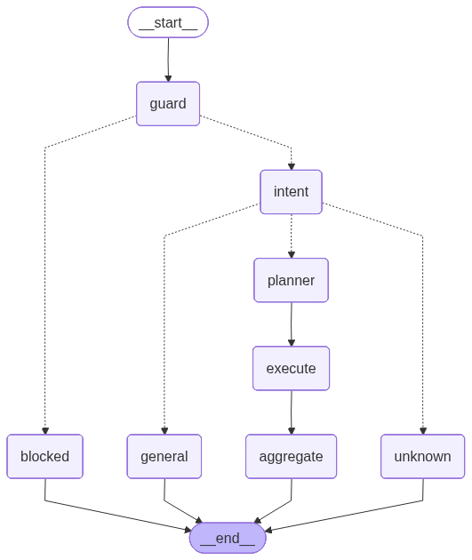

# Multi-Agent + Agentic RAG 电商智能客服系统

## 1. 项目简介

本项目是一个基于 Multi-Agent + Agentic RAG 架构实现的电商智能客服系统。

系统支持：

- 商品价格查询
- 商品库存查询
- 订单物流查询
- 售后政策问答
- 多轮上下文追问
- 多跳任务规划
- Reflection 自动反思与重规划
- Streamlit 网页 Demo

本项目不是简单 FAQ，也不是普通单轮 RAG，而是实现了一个 Agentic RAG 工作流：

Plan -> Retrieve -> Reflect -> Re-plan

---

## 2. 项目效果

用户可以通过 Streamlit 网页进行多轮对话。

推荐演示问题：

1. 华为 Mate 60 多少钱？
2. 华为 Mate 60 有货吗？
3. 小米 14 有货吗？
4. 我的订单 O1001 到哪了？
5. 我的订单 O1001 里的商品可以退货吗？
6. 那退货呢？
7. 那物流呢？

系统能够根据上下文自动判断用户追问的对象。

例如：

用户问：我的订单 O1001 里的商品可以退货吗？

系统会先查询订单，再查询售后政策，最后融合结果回答。

用户继续问：那物流呢？

系统会自动继承上一轮订单 O1001，继续查询物流。

---

## 3. 系统架构

整体流程：

用户问题
↓
SafetyAgent：安全检查
↓
IntentAgent：意图识别
↓
PlannerAgent：任务规划
↓
RetrievalRouter：工具动态路由
↓
商品工具 / 订单工具 / 售后 RAG 工具
↓
ReflectionAgent：证据反思与结果检查
↓
如果证据不足，自动 Re-plan + Re-retrieve
↓
最终回答

---

## 4. 核心 Agent 说明

### SafetyAgent

负责判断用户问题是否安全，是否属于当前客服系统的业务范围。

### IntentAgent

负责识别用户问题意图。

支持识别：

- price_query：价格查询
- stock_query：库存查询
- order_query：订单查询
- policy_query：售后政策查询
- general_query：普通问候
- unknown_query：未知问题

### PlannerAgent

负责任务规划。

例如用户问：

我的订单 O1001 里的商品可以退货吗？

这个问题不是单一任务，而是多跳问题。

系统会自动规划为：

["order_task", "policy_task"]

也就是：

先查订单，再查售后政策。

### RetrievalRouter

负责根据任务列表动态调用不同工具。

任务映射关系：

price_task  -> 商品价格工具
stock_task  -> 商品库存工具
order_task  -> 订单查询工具
policy_task -> 售后政策 RAG 工具

### ReflectionAgent

负责判断当前回答是否可靠。

如果出现以下情况：

- 回答为空
- 证据为空
- 命中失败信号
- 回答过短

系统会认为证据不足，并自动重新规划任务。

---

## 5. Agentic RAG 闭环

普通 RAG 通常是：

Retrieve -> Generate

本项目实现的是：

Plan -> Retrieve -> Reflect -> Re-plan

区别在于：

| 能力 | 普通 RAG | 本项目 |
|---|---|---|
| 单次检索 | 支持 | 支持 |
| 多工具调用 | 不一定支持 | 支持 |
| 多跳任务规划 | 较弱 | 支持 |
| 证据反思 | 不支持 | 支持 |
| 自动重规划 | 不支持 | 支持 |
| 上下文追问 | 较弱 | 支持 |

---

## 6. 项目目录结构

customer_service_agent/
├── app_streamlit.py          # Streamlit 网页 Demo
├── multi_agent.py            # Multi-Agent 主流程
├── planner_agentic.py        # Agentic 任务规划器
├── retrieval_router.py       # 工具路由器
├── reflection_agent.py       # 反思 Agent
├── executors.py              # 工具执行器
├── safety.py                 # 安全检查
├── intent.py                 # 意图识别
├── planner.py                # 基础任务规划
├── db_tools.py               # 数据库查询工具
├── full_rag_policy.py        # 售后政策 RAG
├── memory.py                 # 会话记忆
├── test_multi_agent.py       # 命令行测试入口
├── requirements.txt          # 依赖包
├── ARCHITECTURE.md           # 架构说明
├── RESUME.md                 # 简历描述
├── INTERVIEW_QA.md           # 面试问答
└── RUN_DEMO.md               # 运行说明

---

## 7. 运行方式

### 创建环境

conda create -n customer python=3.11 -y
conda activate customer

### 安装依赖

pip install -r requirements.txt

如果缺少 torchvision，可以执行：

pip install torchvision

### 运行命令行 Demo

python test_multi_agent.py

### 运行网页 Demo

streamlit run app_streamlit.py

启动后打开：

http://localhost:8501

---

## 8. Demo 演示问题

推荐按下面顺序演示：

1. 华为 Mate 60 多少钱？
2. 华为 Mate 60 有货吗？
3. 小米 14 有货吗？
4. 我的订单 O1001 到哪了？
5. 我的订单 O1001 里的商品可以退货吗？
6. 那退货呢？
7. 那物流呢？

这组问题可以完整展示：

- 商品查询
- 库存查询
- 订单查询
- 售后 RAG
- 多跳任务规划
- 上下文追问
- Memory 记忆能力

---

## 9. 项目亮点

### 9.1 Multi-Agent 架构

将客服系统拆分成多个 Agent，每个 Agent 职责清晰，方便扩展和调试。

### 9.2 Agentic RAG 工作流

实现：

Plan -> Retrieve -> Reflect -> Re-plan

而不是普通单次 RAG。

### 9.3 多跳任务规划

复杂问题会自动拆解为多个任务。

例如：

订单商品能否退货？

会被拆成：

订单查询 + 售后政策查询

### 9.4 Reflection 反思机制

系统会检查答案是否足够可靠。

如果证据不足，会自动补任务并重新检索。

### 9.5 Memory 上下文追问

支持：

那退货呢？
那物流呢？

这种省略主语的追问。

### 9.6 Streamlit 网页 Demo

项目不仅支持命令行测试，也支持网页端交互演示。

---

## 10. 后续优化方向

未来可以继续升级：

- 接入真实大模型 API，例如 DeepSeek、Qwen、OpenAI
- 引入向量检索 + rerank
- 增加 Verifier Agent
- 增加长期 Memory
- 封装 FastAPI 后端服务
- 部署到公网
- 增加自动化评测集
- 增加 Docker 部署

---

## 11. 一句话总结

这是一个具备任务规划、工具调用、证据反思、自动重规划和上下文记忆能力的 Multi-Agent Agentic RAG 电商智能客服系统。

